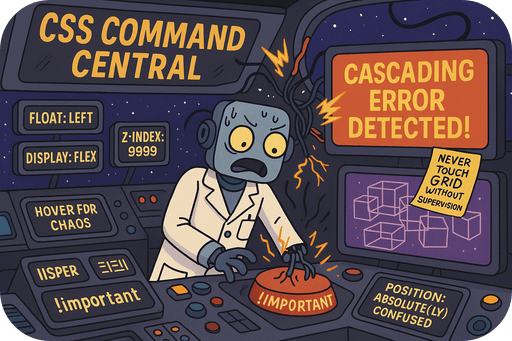

# abstract-css

> ⚠️ This module is a plugin for [`css-engine`](/modules/standalone/css-engine/readme.md).

What if writing CSS could be as **straightforward as speaking**?



This project is an effort to make that possible by providing a **declarative abstraction** that reimagines how stylesheets are composed. The stylesheets are **readable and easy to understand**, making the styling process more approachable, especially for beginners and non-technical individuals.

---

### ?

First and foremost, the plugin is designed to reflect my vision of how CSS should be written. It is **not** intended to be a replacement for the [CSS specification](https://www.w3.org/TR/css-syntax-3/), but rather an attempt to provide a **declarative alternative that is easy to learn**.

#### ?

The language is designed to be **flexible**, allowing standard CSS to be mixed with custom directives and selectors. This makes it easy to use as much or as little of the language as is needed or desired.

```
?
```

It's also **highly extensible**, allowing for further customization and **integration with other tools and frameworks** through plugins. Each plugin can modify the input string, transform the parsed tree structure, or handle the final output in whatever way is necessary.

#### ?

...

---

### An example of how an abstract stylesheet might look like

```
body
{
  set font-size to 14px

  device tablet .. laptop
  {
    set font-size to 16px
  }
}

h1
{
  set color to black
  set font-size to 200%
}

form
{
  descendant input
  {
    set color to blue
  }

  child button
  {
    attribute type is "submit"
    {
      
    }
  }
}
```